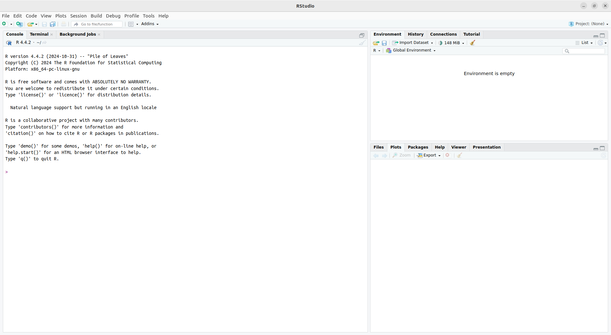
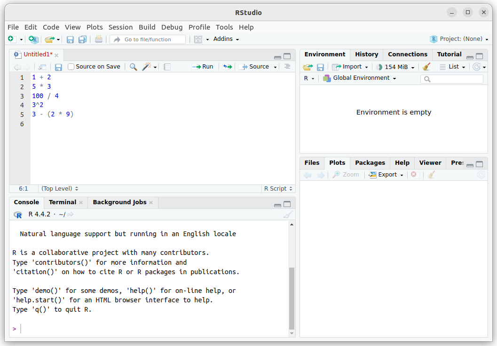

# R y RStudio {background="#5B888C"}

## ¿Qué es un IDE?

Un **Entorno Integrado de Desarrollo** (IDE, *Integrated Development Environment*) es un programa que facilita la codificación.

::: {.small}
R es el lenguaje, pero es difícil de usar directamente. RStudio es un IDE que simplifica el trabajo.
:::

## Ventajas de usar RStudio

::: columns
::: {.column width="50%"}

✓ Manejar varios archivos de código  
✓ Visualizar el ambiente de trabajo  
✓ Resaltado de sintaxis (colores)  
✓ Autocompletado de código

:::

::: {.column width="50%"}

✓ Ayuda integrada  
✓ Depuración de errores  
✓ Ejecutar y ver resultados  
✓ Intercalar código y resultados

:::
:::

## Instalación

Descargar e instalar desde:

- [**R**](https://www.r-project.org/)
- [**RStudio**](https://posit.co/)

::: {.small}
Guías disponibles con instrucciones paso a paso en los materiales del curso.

**Alternativa online**: Si la instalación falla, usar Posit Cloud (necesita internet)
:::

# Paneles de RStudio {background="#5B888C"}

## Los tres paneles principales

{width="80%" fig-align="center"}

## Panel Izquierdo: Console

::: {.small}
**La pestaña más importante: Console**

- Es donde se ejecutan las instrucciones de R
- Se escriben comandos y se presiona `Enter`
- Aparecen los resultados inmediatamente
- El símbolo `>` indica que R está listo para recibir un comando

Este es el lugar donde nos comunicamos con R.
:::

## Panel Superior Derecho: Environment

::: {.small}
**La pestaña más importante: Environment**

- Muestra los elementos disponibles para programar
- Al iniciar está vacío
- Acá aparecen las variables y datos que creamos
- Nos ayuda a tener una vista de qué tenemos en memoria

:::

## Panel Inferior Derecho: Varias pestañas

::: {.small}

| Pestaña | Función |
|---------|---------|
| **Files** | Explorador de archivos de la computadora |
| **Plots** | Visualización de gráficos |
| **Packages** | Listado de paquetes instalados |
| **Help** | Manual de ayuda de R |

:::

# Usando la Consola {background="#5B888C"}

## Primeros comandos

La consola permite ejecutar comandos inmediatamente:

```r
1 + 2
```

Presionamos `Enter` y obtenemos el resultado:

```
[1] 3
```

El `[1]` indica que es el primer (y único) resultado.

## Operaciones matemáticas

```r
1 + 2      # suma
5 * 3      # multiplicación
100 / 4    # división
3^2        # potencia
3 - (2 * 9) # operaciones complejas
```


## ¿Qué pasa si cometo un error?

::: {.small}
**Si escribo un comando incompleto:**

```r
100 /
```

R muestra `+` en lugar de `>`, indicando que falta algo. Puedo:

- Completar el comando y presionar `Enter`
- Presionar `Esc` para cancelar

**Si escribo algo que R no entiende:**

```r
100 % 4  # Error: % no es división
```

R muestra un mensaje de error. Eso es normal, significa que la sintaxis no es correcta.
:::

# Scripts: Organizando el Código {background="#5B888C"}

## ¿Por qué necesitamos scripts?

Escribir en la consola es útil para pruebas rápidas, pero para **tareas complejas** necesitamos:

- **Guardar** el código para reutilizarlo
- **Modificarlo** sin reescribir
- **Compartirlo** con otros
- **Organizar** mejor el trabajo

## ¿Qué es un script?

::: {.concepto data-latex=""}
Un **script** (o **archivo de código**) es un archivo de texto que contiene una serie de instrucciones de R. Se ejecuta completo cuando es necesario, sin reescribir.
:::

### Ventajas

✓ **Reproducibilidad**: ejecutar el mismo código una y otra vez  
✓ **Organización**: estructurar el trabajo en secciones  
✓ **Depuración**: encontrar y corregir errores más fácilmente

## Crear un script

Opciones para crear un nuevo script:

- Menú: `File > New > R Script`
- Atajo: `Ctrl + Shift + N`
- Icono de hoja en blanco en la barra de herramientas

El editor de scripts aparece arriba de la consola.

## Guardar el script

Para guardar:

- Menú: `File > Save`
- Atajo: `Ctrl + S`
- Icono de guardar en la barra

::: {.small}
**La primera vez**, elegir:

- Nombre del archivo (ej: "ejemplos")
- Ubicación en la computadora

La extensión `.R` se agrega automáticamente.
:::

## Estructura de un archivo

```
nombre . extensión
```

- **ejemplos.R**
  - `ejemplos` = raíz (nombre que elegimos)
  - `.R` = extensión (indica que es código R)

Otros ejemplos: `.txt` (texto), `.xlsx` (Excel), `.jpg` (imagen)

## Ejecutar código desde el script

Para ejecutar código escrito en un script:

- Seleccionar líneas y presionar `Ctrl + Enter`
- Seleccionar líneas y hacer clic en el botón `Run`
- Sin selección: ejecuta la línea donde está el cursor

Los resultados aparecen en la consola.

## Ejemplo: Script con cálculos

{width="75%" fig-align="center"}

# Comentarios en el Código {background="#5B888C"}

## ¿Qué son los comentarios?

Los comentarios son **líneas que R ignora**. Se escriben para documentar el código.

En R se escriben con el símbolo `#`:

```r
# Esto es un comentario
resultado <- 1 + 2  # R ignora esto
```

## Por qué usar comentarios

✓ Documentar qué hace cada sección  
✓ Explicar decisiones de diseño  
✓ Facilitar lectura para vos y otros  
✓ Marcar secciones importantes  

```r
# ===== SECCIÓN 1: Carga de datos =====
datos <- read.csv("archivo.csv")

# ===== SECCIÓN 2: Análisis =====
promedio <- mean(datos)
```

# Funciones en R {background="#5B888C"}

## ¿Qué es una función?

Una **función** es un comando que realiza una operación específica.

Ejemplo: calcular una raíz cuadrada:

```r
sqrt(49)
```

Resultado: `7`

## Estructura de una función

```r
nombre_función(argumento1, argumento2, ...)
```

- **Nombre**: identifica la función (ej: `sqrt`)
- **Paréntesis**: contienen los argumentos
- **Argumentos**: información que le damos a la función

## Ejemplos de funciones

```r
sqrt(49)        # raíz cuadrada
log(100)        # logaritmo natural
log(100, 10)    # logaritmo en base 10
abs(-5)         # valor absoluto
```

## Argumentos obligatorios vs. opcionales

::: {.small}
**Argumentos obligatorios**: deben ser especificados

**Argumentos opcionales**: tienen un valor por defecto

Ejemplo con `log()`:

- `x`: obligatorio (el número)
- `base`: opcional (por defecto es $e$)

```r
log(100)           # usa base por defecto (e)
log(100, 10)       # especifica base = 10
log(x = 100, base = 10)  # nombrados explícitamente
log(base = 10, x = 100)  # orden no importa si están nombrados
```
:::

## Obtener ayuda sobre funciones

Para saber cómo usar una función:

```r
help(log)    # abre la página de ayuda
?log         # alternativa más corta
```

La ayuda muestra:

- **Usage**: cómo se usa
- **Arguments**: qué argumentos tiene
- **Details**: explicaciones

## Ejemplo: Función log()

```r
# Tres formas equivalentes:
log(100, 10)
log(x = 100, base = 10)
log(base = 10, x = 100)

# Sin especificar la base (usa ln):
log(100)

# Esto da error (falta argumento obligatorio):
log(base = 10)  # ¿Logaritmo de qué?
```

# Resumen {background="#5B888C"}

## Puntos clave

::: {.small}
1. **RStudio** es un IDE que facilita la programación en R
2. La **consola** es donde ejecutamos comandos
3. Los **scripts** sirven para guardar y organizar código
4. Los **comentarios** documentan el código (con `#`)
5. Las **funciones** realizan operaciones específicas
6. Los **argumentos** son la información que damos a las funciones
7. Podemos obtener **ayuda** con `help()` o `?`

:::

::: {.center}
**¡Ahora tenemos las herramientas para programar!**
:::
